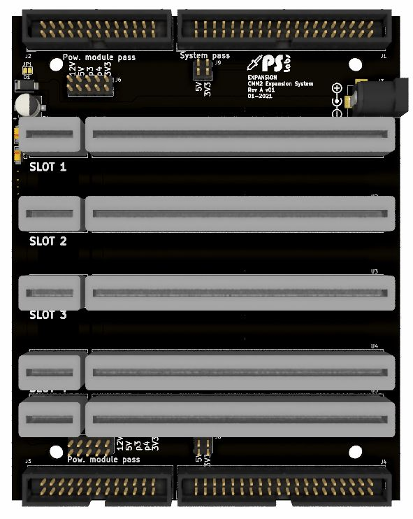
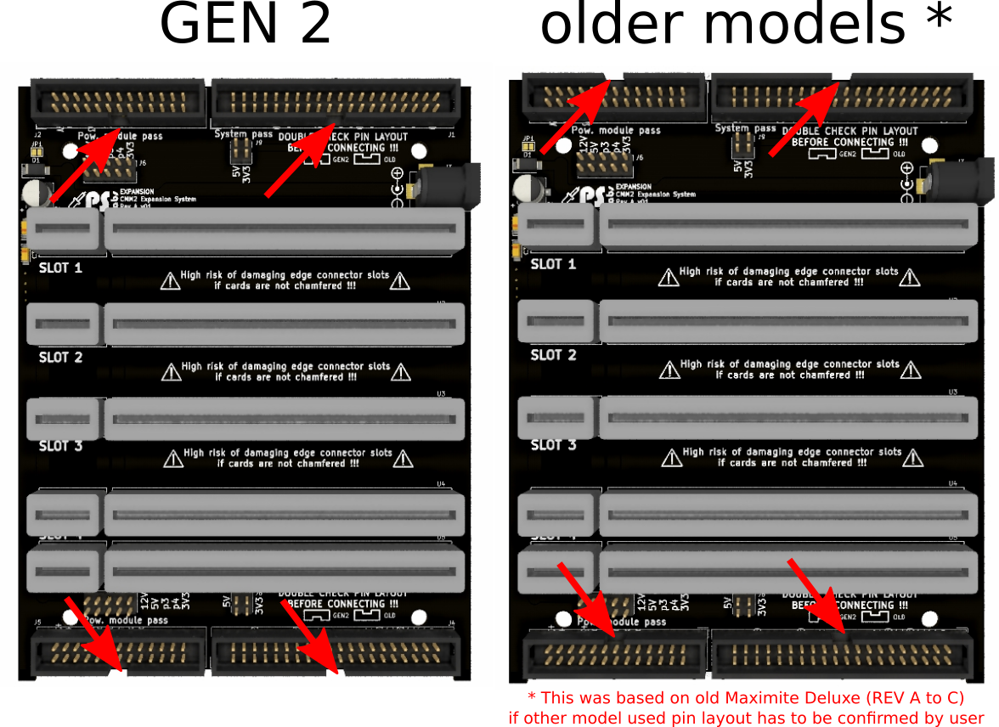

# CMM2 Expansion System

Expansion system for CMM2 was created to add easy to use expansion system for CMM2

Schematic can be found here: [schematic REV A v02](/Schematic/exp_syst_REVA_v02.pdf)

# WARNING!

Expansion card used with this system have to have edges champfered, using unchampfered card will result in slot dammage

# Assembly
1. test
2. test  2 assssssssssssssssssssssssssssssssssss asdddddddddddddddddddddddddd asdddddddddddddddddddddddddddddddddd asdddddddddddddddddddddddddddddddddddd asddddddddddddddddddd

# Old vs GEN2 expansion build
Since pin layout have been changed durring GEN2 introduction You have to double check pin layout before connecting. In case of assempling expnasion for GEN2 consoles install idc connectors as shown below:

