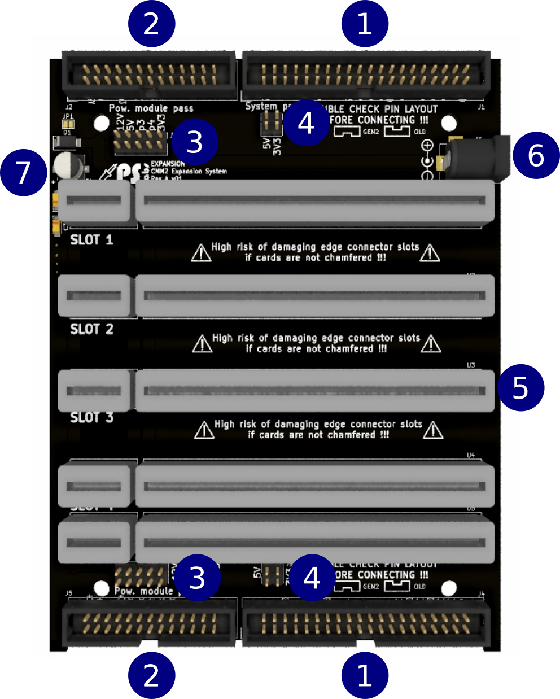
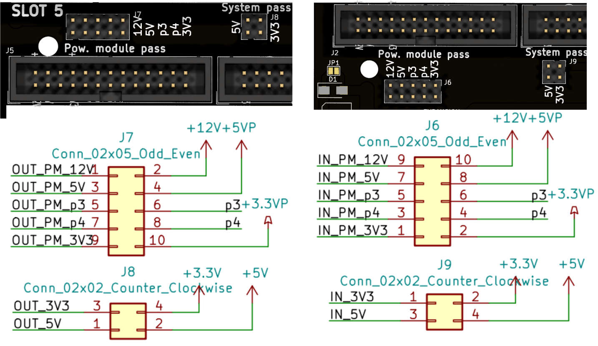

# CMM2 Expansion System

Expansion system for CMM2 was created to add easy to use expansion system for CMM2

Schematic can be found here: [schematic REV A v02](/Schematic/exp_syst_REVA_v02.pdf)

Expansion system and cards can be purchased here: [PS Labs](https://sklep.pslabs.pl/Maximite-c91)

1. 2x20 IDC connector compatible with Maximite
2. 2x13 IDC additional connection for expansion system
3. Power supply selector and power supply daisy chain
4. Power supply selector and power supply daisy chain
5. Edge connector slots
6. 12V DC 2,5/5,5mm connector
7. Place for filtering capacitators installation

# WARNING!

Expansion card used with this system have to have edges chamfered, using unchamfered card will result in slot damage.

# Assembly
1. Install protection diode D1. This diode prevent reversed polarity on 12V supply. Instead of diode You can also close jumper JP1, please remember that You will about risk of revers polarity on 12V line, reversed polarity will damage expansion system, expansion cards and Maximite unit.
2. If needed install smoothing capacitators (not included in kit) C1, C2, C3
3. Cut goldpin headers with pliers to correct length and install J6, J7, J8. J9
4. Install DC connector J3
5. Install IDC connectors J1, J2, J4, J5, for correct orientation check chapter **"Old vs GEN2 expansion build"**
6. Install edge connector slots, be careful to align 8 and 60 pin slot in each row
7. Install jumpers accordingly to chapter **"Power supply selector and power supply daisy chain"**

# Old vs GEN2 expansion build
Since IDC40 pin layout have been changed during GEN2 introduction You have to double check pin layout before connecting. In case of assembling expansion for GEN2 consoles install IDC connectors as shown below:

# Power supply selector and power supply daisy chain

J6, J7, J8. J9 are used to decide if various power lines should be daisy chained between expansions or Maximite and expansions

| Jumper | Desc. | Remarks |
| --- | --- | --- |
| J6, J7 | 12V | 12V line from external 12 power supply connected to Maximite Deluxe or Expansion |
| J6, J7 | 5V, 3V3 | high efficient 5V and 3,3V from power expansion card |
| J6, J7 | p3, p4 | additional power lines currently not used |
| J8, J9 | 5V, 3V3 | 5V and 3,3V line from Maximite power line |

## Example
Lets assume following setup: Maximite Deluxe GEN2 >>> 1st Expansion >>> 2nd Expansion
and jumpers on 2st Expansion set as below:

12V power from Maximite 12v power supply will be connected to first and 2nd expansion. 5V and 3,3V from internal power supply of Maximite will be connected to first expansion but will not to 2nd. 2nd Expansion will receive 3.3V, 5V power cards on 1st expansion.

# How to make expansion card

Everything needed to start creating Your own expansion cards can be found here:

[Kicad expansion card](Kicad/exp_card/)

# Expansion cards
Following expansion cards are available or are in development:

| ID | Name | Desc. | Status |
| --- | --- | --- | --- |
| 01 | [Mouse/joystick card](https://github.com/pslabs-ps/CMM2-ExpansionCard-MouseJoy) | adds: USB mouse (HT chip) including wireless, Atari joystick, Nunchuk port | done |
| 02 | Relay card | Relay card controlled by shift registers, can be daisy chained, only 3 pins needed to operate multiple cards | in progress |
| 03 | Power card | delivers high amperage 5V and 3.3V to be used with power hungry cards | done |
| 04 | Prototyping card | simple prototyping card | done |
| 05 | WiFi card | adds wifi functionality, includes USB to RS chip allowing easy flashing and communication with pc | done |
| 06 | Shift register card | helps to learn how shift registers work, 16 led operated from 3 pins, can be daisy chained | done |
| 07 | rs232 card | adds 2 standard RS232 ports | in progress |
